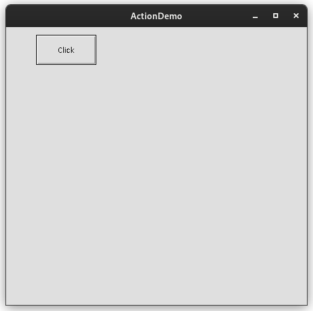
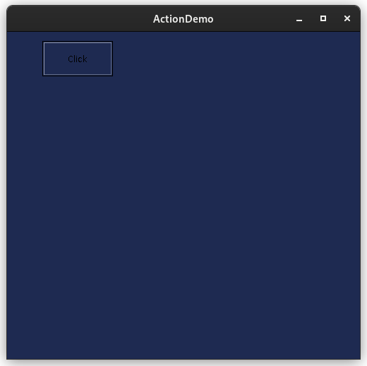
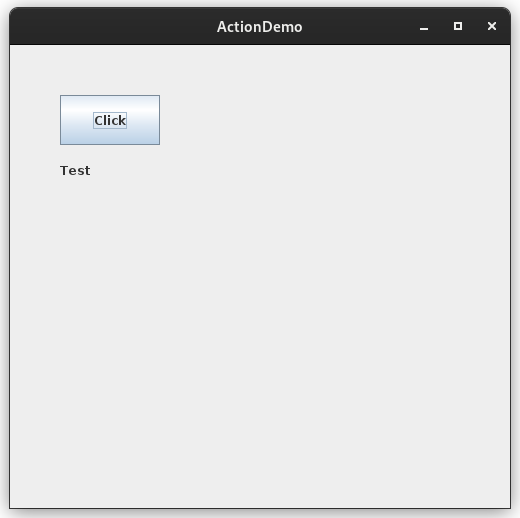
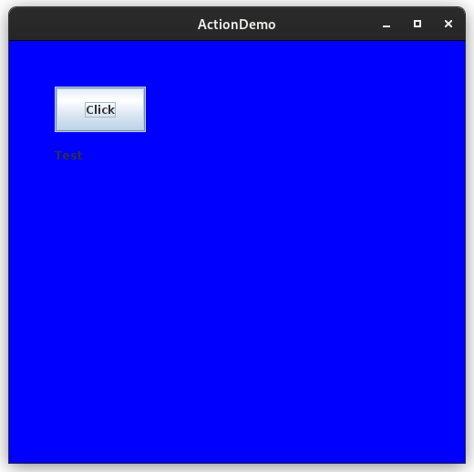

# Notes (November 18, 2022)

## Topics

- Action

## General Notes

- ActionEvent .. ActionListener ... Button,List (Equivalent controls in Swing: JButton, JList)
- All **awt controls are heavyweight controls** whereas **Swing controls are lightweight controls**.
- The default layout for a frame is BorderLayout.

## ActionEvent Package (*disassembeled*)

```bash
javap java.awt.event.ActionEvent
Compiled from "ActionEvent.java"
public class java.awt.event.ActionEvent extends java.awt.AWTEvent {
  public static final int SHIFT_MASK;
  public static final int CTRL_MASK;
  public static final int META_MASK;
  public static final int ALT_MASK;
  public static final int ACTION_FIRST;
  public static final int ACTION_LAST;
  public static final int ACTION_PERFORMED;
  java.lang.String actionCommand;
  long when;
  int modifiers;
  public java.awt.event.ActionEvent(java.lang.Object, int, java.lang.String);
  public java.awt.event.ActionEvent(java.lang.Object, int, java.lang.String, int);
  public java.awt.event.ActionEvent(java.lang.Object, int, java.lang.String, long, int);
  public java.lang.String getActionCommand();
  public long getWhen();
  public int getModifiers();
  public java.lang.String paramString();
```

## ActionListener (*disassembeled*)

```bash
 javap java.awt.event.ActionListener
Compiled from "ActionListener.java"
public interface java.awt.event.ActionListener extends java.util.EventListener {
  public abstract void actionPerformed(java.awt.event.ActionEvent);
}
```

## `awt.Button` class (*disassembeled*)

```bash
javap java.awt.Button
Compiled from "Button.java"
public class java.awt.Button extends java.awt.Component implements javax.accessibility.Accessible {
  java.lang.String label;
  java.lang.String actionCommand;
  transient java.awt.event.ActionListener actionListener;
  public java.awt.Button() throws java.awt.HeadlessException;
  public java.awt.Button(java.lang.String) throws java.awt.HeadlessException;
  java.lang.String constructComponentName();
  public void addNotify();
  public java.lang.String getLabel();
  public void setLabel(java.lang.String);
  public void setActionCommand(java.lang.String);
  public java.lang.String getActionCommand();
  public synchronized void addActionListener(java.awt.event.ActionListener);
  public synchronized void removeActionListener(java.awt.event.ActionListener);
  public synchronized java.awt.event.ActionListener[] getActionListeners();
  public <T extends java.util.EventListener> T[] getListeners(java.lang.Class<T>);
  boolean eventEnabled(java.awt.AWTEvent);
  protected void processEvent(java.awt.AWTEvent);
  protected void processActionEvent(java.awt.event.ActionEvent);
  protected java.lang.String paramString();
  public javax.accessibility.AccessibleContext getAccessibleContext();
  static {};
}
```

## Color class (*disassembeled*)

```bash
javap java.awt.Color
Compiled from "Color.java"
public class java.awt.Color implements java.awt.Paint,java.io.Serializable {
  public static final java.awt.Color white;
  public static final java.awt.Color WHITE;
  public static final java.awt.Color lightGray;
  public static final java.awt.Color LIGHT_GRAY;
  public static final java.awt.Color gray;
  public static final java.awt.Color GRAY;
  public static final java.awt.Color darkGray;
  public static final java.awt.Color DARK_GRAY;
  public static final java.awt.Color black;
  public static final java.awt.Color BLACK;
  public static final java.awt.Color red;
  public static final java.awt.Color RED;
  public static final java.awt.Color pink;
  public static final java.awt.Color PINK;
  public static final java.awt.Color orange;
  public static final java.awt.Color ORANGE;
  public static final java.awt.Color yellow;
  public static final java.awt.Color YELLOW;
  public static final java.awt.Color green;
  public static final java.awt.Color GREEN;
  public static final java.awt.Color magenta;
  public static final java.awt.Color MAGENTA;
  public static final java.awt.Color cyan;
  public static final java.awt.Color CYAN;
  public static final java.awt.Color blue;
  public static final java.awt.Color BLUE;
  int value;
  public java.awt.Color(int, int, int);
  public java.awt.Color(int, int, int, int);
  public java.awt.Color(int);
  public java.awt.Color(int, boolean);
  public java.awt.Color(float, float, float);
  public java.awt.Color(float, float, float, float);
  public java.awt.Color(java.awt.color.ColorSpace, float[], float);
  public int getRed();
  public int getGreen();
  public int getBlue();
  public int getAlpha();
  public int getRGB();
  public java.awt.Color brighter();
  public java.awt.Color darker();
  public int hashCode();
  public boolean equals(java.lang.Object);
  public java.lang.String toString();
  public static java.awt.Color decode(java.lang.String) throws java.lang.NumberFormatException;
  public static java.awt.Color getColor(java.lang.String);
  public static java.awt.Color getColor(java.lang.String, java.awt.Color);
  public static java.awt.Color getColor(java.lang.String, int);
  public static int HSBtoRGB(float, float, float);
  public static float[] RGBtoHSB(int, int, int, float[]);
  public static java.awt.Color getHSBColor(float, float, float);
  public float[] getRGBComponents(float[]);
  public float[] getRGBColorComponents(float[]);
  public float[] getComponents(float[]);
  public float[] getColorComponents(float[]);
  public float[] getComponents(java.awt.color.ColorSpace, float[]);
  public float[] getColorComponents(java.awt.color.ColorSpace, float[]);
  public java.awt.color.ColorSpace getColorSpace();
  public synchronized java.awt.PaintContext createContext(java.awt.image.ColorModel, java.awt.Rectangle, java.awt.geom.Rectangle2D, java.awt.geom.AffineTransform, java.awt.RenderingHints);
  public int getTransparency();
  static {};
}
```

## Programs

### Program 1

```java
import java.awt.*;

class ActionFrame extends Frame{
    Button b;
    ActionFrame(){
        setVisible(true); //setVisible is false by default for frame
        setSize(500,500);
        setTitle("ActionDemo");
        setLayout(null);
        b=new Button("Click");
        add(b);
        b.setBounds(50,50,100,50);
    }
    public static void main(String args[]){
        new ActionFrame();
    }
}
```

### Program 2:- Set background (Random)

```java
import java.awt.*;
import java.awt.event.*;
import java.util.Random; //Never use util package with * as there are so many pacakages in it, compilation time increases

class ActionFrame extends Frame implements ActionListener{
    Button b;
    ActionFrame(){
        setVisible(true); //setVisible is false by default for frame
        setSize(500,500);
        setTitle("ActionDemo");
        setLayout(null);

        b=new Button("Click");
        add(b);
        b.setBounds(50,50,100,50);

        b.addActionListener(this);
    }
    public void actionPerformed(ActionEvent ae){
        Random r=new Random();
        setBackground(new Color(r.nextInt()%255,r.nextInt()%255,r.nextInt()%255));
    }
    public static void main(String args[]){
        new ActionFrame();
    }
}
```

- Output:-

### Program 2b: Set background using Swing

```java
import java.awt.*;
import java.awt.event.*;
//import java.util.Random; //Never use util package with * as there are so many pacakages in it, compilation time increases
import javax.swing.*;

class ActionFrame extends JFrame implements ActionListener{
    JButton b;
    ActionFrame(){
        setVisible(true); //setVisible is false by default for frame
        setSize(500,500);
        setTitle("ActionDemo");
        setLayout(null);

        b=new JButton("Click");
        add(b);
        b.setBounds(50,50,100,50);

        b.addActionListener(this);
    }
    public void actionPerformed(ActionEvent ae){
        //Random r=new Random();
        getContentPane().setBackground(Color.blue);
    }
    public static void main(String args[]){
        new ActionFrame();
    }
}
```

- Output:-





### Program 2c:-

```java
import java.awt.*;
import java.awt.event.*;
//import java.util.Random; //Never use util package with * as there are so many pacakages in it, compilation time increases
import javax.swing.*;

class ActionFrame extends JFrame implements ActionListener{
    JButton b;
    JLabel l;
    ActionFrame(){
        setVisible(true); //setVisible is false by default for frame
        setSize(500,500);
        setTitle("ActionDemo");
        setLayout(null);

        b=new JButton("Click");
        l=new JLabel("Test");
        add(b);
        b.setBounds(50,50,100,50);
        add(l);
        l.setBounds(50,100,300,50);

        b.addActionListener(this);
    }
    public void actionPerformed(ActionEvent ae){
        //Random r=new Random();
        getContentPane().setBackground(Color.blue);
    }
    public static void main(String args[]){
        new ActionFrame();
    }
}
```

- Output:-




