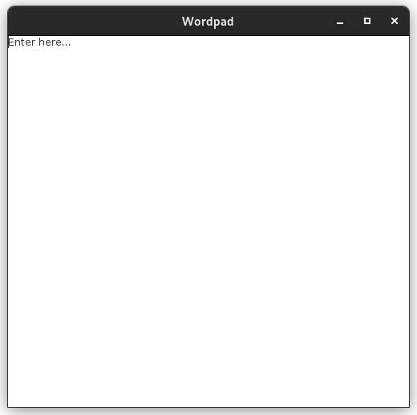
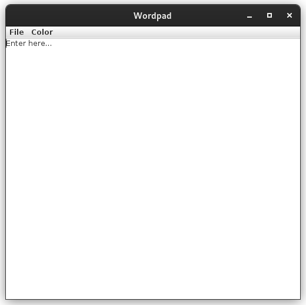

# Notes (November 26, 2022)

## Topics

- Swing..Menu Handling

## General Notes

- Types of menu items: Pull down menu item/Standard Menu item and pop-up menu item.
- Swing components are look and feel components (By default, the Color is grey).

## Programs

### Program 1a: WordPad using Swing

```java
import javax.swing.*;
import java.awt.*;
import java.awt.event.*;

class WordPad{
    JFrame frm;
    JTextArea ta;
    WordPad(){
        frm=new JFrame("Wordpad");
        frm.setVisible(true);
        frm.setSize(500,500);
        frm.setLayout(null);
        frm.setDefaultCloseOperation(JFrame.EXIT_ON_CLOSE);
        ta=new JTextArea("Enter here...");
        ta.setBounds(0,0,frm.getWidth(),frm.getHeight());
        frm.add(ta);
    }
    public static void main(String[] args) {
            SwingUtilities.invokeLater(new Runnable() { //nameless object
                    public void run(){
                        new WordPad();
                    }
            });
    }
}
```

- Output:-



### Program 1b:-

```java
import javax.swing.*;
import java.awt.*;
import java.awt.event.*;

class EditFrame{
    JFrame frm;
    JTextArea ta;
    JMenuBar mb;
    JMenu filemnu;
    JMenu colormnu;
    EditFrame(){
        frm=new JFrame("Wordpad");
        frm.setVisible(true);
        frm.setSize(500,500);
        frm.setLayout(null);
        frm.setDefaultCloseOperation(JFrame.EXIT_ON_CLOSE);
        ta=new JTextArea("Enter here...");
        ta.setBounds(0,0,frm.getWidth(),frm.getHeight());
        frm.add(ta);

        mb=new JMenuBar();
        frm.setJMenuBar(mb);
        filemnu=new JMenu("File");
        mb.add(filemnu);

        colormnu=new JMenu("Color");
        mb.add(colormnu);
    }

    public void paint(Graphics g){
    }

    public static void main(String[] args) {
            SwingUtilities.invokeLater(new Runnable() { //nameless object
                    public void run(){
                        new EditFrame();
                    }
            });
    }
}
```

- Output:-



### Program 1c:-

```java
import javax.swing.*;
import java.awt.*;
import java.awt.event.*;

class EditFrame{
    JFrame frm;
    JTextArea ta;
    JMenuBar mb;
    JMenu filemnu;
    JMenu colormnu;
    JMenuItem savemnuitm,opMenuItem;
    JCheckBoxMenuItem bcmnuitm,fcmnuitm;
    EditFrame(){
        frm=new JFrame("Wordpad");
        frm.setVisible(true);
        frm.setSize(500,500);
        frm.setLayout(null);
        frm.setDefaultCloseOperation(JFrame.EXIT_ON_CLOSE);
        ta=new JTextArea("Enter here...");
        ta.setBounds(0,0,frm.getWidth(),frm.getHeight());
        frm.add(ta);

        mb=new JMenuBar();
        frm.setJMenuBar(mb);
        filemnu=new JMenu("File");
        mb.add(filemnu);

        colormnu=new JMenu("Color");
        mb.add(colormnu);
        savemnuitm=new JMenuItem("Save");
        opMenuItem=new JMenuItem("Open");
        filemnu.add(savemnuitm);
        filemnu.add(opMenuItem);

        bcmnuitm=new JCheckBoxMenuItem("Background");
        fcmnuitm=new JCheckBoxMenuItem("Foreground");
        colormnu.add(bcmnuitm);
        colormnu.add(fcmnuitm);
    }

    public void paint(Graphics g){
    }

    public static void main(String[] args) {
            SwingUtilities.invokeLater(new Runnable() { //nameless object
                    public void run(){
                        new EditFrame();
                    }
            });
    }
}
```

### Program 1d:-

```java
import javax.swing.*;
import java.awt.*;
import java.awt.event.*;

class EditFrame implements ItemListener{
    JFrame frm;
    JTextArea ta;
    JMenuBar mb;
    JMenu filemnu;
    JMenu colormnu;
    JMenuItem savemnuitm,opMenuItem;
    JCheckBoxMenuItem bcmnuitm,fcmnuitm;
    EditFrame(){
        frm=new JFrame("Wordpad");
        frm.setVisible(true);
        frm.setSize(500,500);
        frm.setLayout(null);
        frm.setDefaultCloseOperation(JFrame.EXIT_ON_CLOSE);
        ta=new JTextArea("Enter here...");
        ta.setBounds(0,0,frm.getWidth(),frm.getHeight());
        frm.add(ta);

        mb=new JMenuBar();
        frm.setJMenuBar(mb);
        filemnu=new JMenu("File");
        mb.add(filemnu);

        colormnu=new JMenu("Color");
        mb.add(colormnu);
        savemnuitm=new JMenuItem("Save");
        opMenuItem=new JMenuItem("Open");
        filemnu.add(savemnuitm);
        filemnu.add(opMenuItem);

        bcmnuitm=new JCheckBoxMenuItem("Background");
        fcmnuitm=new JCheckBoxMenuItem("Foreground");
        colormnu.add(bcmnuitm);
        colormnu.add(fcmnuitm);
        bcmnuitm.addItemListener(this);
        fcmnuitm.addItemListener(this);

    }

    public void itemStateChanged(ItemEvent ie){
        if (ie.getSource()==bcmnuitm)
                if (bcmnuitm.getState())
                        ta.setBackground(Color.red);
                else
                        frm.setBackground(Color.white);
        else
                if (fcmnuitm.getState())
                        ta.setForeground(Color.yellow);
                else
                ta.setForeground(Color.black);  
    }

    public void paint(Graphics g){
        
    }

    public static void main(String[] args) {
            SwingUtilities.invokeLater(new Runnable() { //nameless object
                    public void run(){
                        new EditFrame();
                    }
            });
    }
}
```

- Output:-

[out.webm](https://user-images.githubusercontent.com/26346867/204096757-d2145a4c-9087-4da6-9724-0a13b71c1140.webm)

<center><video controls>
  <source src="https://user-images.githubusercontent.com/26346867/204096757-d2145a4c-9087-4da6-9724-0a13b71c1140.webm" type="video/webm">
  Your browser does not support the video tag.
</video></center>

## References

### MenuBar class (*disassembeled*)

```bash
$ javap javax.swing.JMenuBar
Compiled from "JMenuBar.java"
public class javax.swing.JMenuBar extends javax.swing.JComponent implements javax.accessibility.Accessible,javax.swing.MenuElement {
  public javax.swing.JMenuBar();
  public javax.swing.plaf.MenuBarUI getUI();
  public void setUI(javax.swing.plaf.MenuBarUI);
  public void updateUI();
  public java.lang.String getUIClassID();
  public javax.swing.SingleSelectionModel getSelectionModel();
  public void setSelectionModel(javax.swing.SingleSelectionModel);
  public javax.swing.JMenu add(javax.swing.JMenu);
  public javax.swing.JMenu getMenu(int);
  public int getMenuCount();
  public void setHelpMenu(javax.swing.JMenu);
  public javax.swing.JMenu getHelpMenu();
  public java.awt.Component getComponentAtIndex(int);
  public int getComponentIndex(java.awt.Component);
  public void setSelected(java.awt.Component);
  public boolean isSelected();
  public boolean isBorderPainted();
  public void setBorderPainted(boolean);
  protected void paintBorder(java.awt.Graphics);
  public void setMargin(java.awt.Insets);
  public java.awt.Insets getMargin();
  public void processMouseEvent(java.awt.event.MouseEvent, javax.swing.MenuElement[], javax.swing.MenuSelectionManager);
  public void processKeyEvent(java.awt.event.KeyEvent, javax.swing.MenuElement[], javax.swing.MenuSelectionManager);
  public void menuSelectionChanged(boolean);
  public javax.swing.MenuElement[] getSubElements();
  public java.awt.Component getComponent();
  protected java.lang.String paramString();
  public javax.accessibility.AccessibleContext getAccessibleContext();
  protected boolean processKeyBinding(javax.swing.KeyStroke, java.awt.event.KeyEvent, int, boolean);
  static boolean processBindingForKeyStrokeRecursive(javax.swing.MenuElement, javax.swing.KeyStroke, java.awt.event.KeyEvent, int, boolean);
  public void addNotify();
  public void removeNotify();
  public javax.swing.plaf.ComponentUI getUI();
}
```
