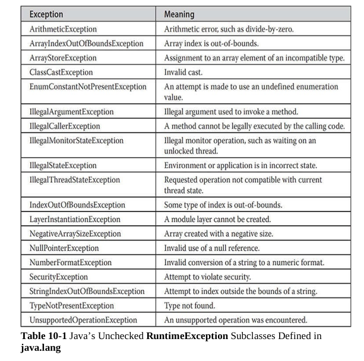
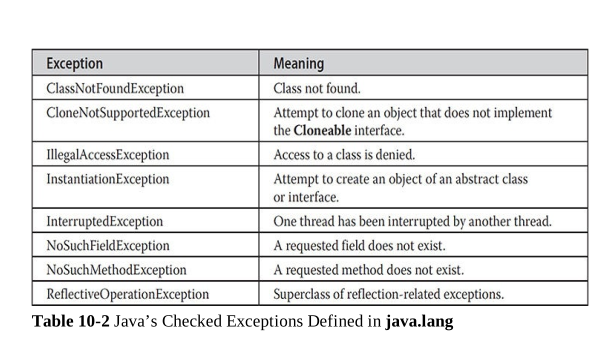

# Notes (September 27,2022)

## Topics

- Arithmetic Exception
- ArrayIndexOutOfBoundsException

## General Notes

- Try without catch isn't possible similarly catch without try block isn't possible.

```java
try{
// set of statement/codeblocks that are prone to error of exception will be kept here.
}
catch{
    //handler
}
```

- Handler is a meaninful output to enduser.
- If there is no try catch block JVM will handle it. But when JVM handles an exception the control doesn't come back to program.
- If we don't know the exception we can use a Generic Handler.
- Discovery: Catch inside try is allowed.

## Arithmetic Exception

- Packages:

```bash
[user]$ javap java.lang.ArithmeticException
Compiled from "ArithmeticException.java"
public class java.lang.ArithmeticException extends java.lang.RuntimeException {
  public java.lang.ArithmeticException();
  public java.lang.ArithmeticException(java.lang.String);
}
```

## Exception Reference





> Note: All right reserved to original authors this image has only been added for your reference. Book: Java Complete Reference Eleventh Edition.


### Program 1: Arithmetic exception and ArrayIndexOutOfBounds Exceptions

```java
import java.util.Scanner;
class Test{import java.util.Scanner;
class Test{
    public static void main(String args[]){
        int a=10;
        Scanner in=new Scanner(System.in);
        int b=in.nextInt();
        int x[]={10,20,30,40,50};
        String s;
        try{
                a=a/b;
                System.out.println("a="+a);
                int l=s[1].length();   //possibility of null pointer exception
                System.out.println("X[5]"+x[5]);
        }catch(ArithmeticException e){
                System.out.println("Error.."+e); /**+e invokes 2 string function.
                 When developer return this function a detailed error message will be displayed.**/
        }
        catch(ArrayIndexOutOfBoundsException e){
                System.out.println("Error.."+e);
        }
        catch(Exception e){
                System.out.println("Error.."+e);  
        }
        System.out.println("After catch...");
    }
}
    public static void main(String args[]){
        int a=10;
        Scanner in=new Scanner(System.in);
        int b=in.nextInt();
        int x[]={10,20,30,40,50};
        try{
                a=a/b;
                System.out.println("a="+a);
                System.out.println("X[5]"+x[5]);
        }catch(ArithmeticException e){
                System.out.println("Error.."+e); /**+e invokes 2 string function.
                 When developer return this function a detailed error message will be displayed.**/
        }
        catch(ArrayIndexOutOfBoundsException e){
                System.out.println("Error.."+e);
        }
        System.out.println("After catch...");
    }
}
```

- Output :-

```bash
[user]$ java Test
0
Error..java.lang.ArithmeticException: / by zero
After catch...

[user]$ java Test
1
a=10
Error..java.lang.ArrayIndexOutOfBoundsException: Index 5 out of bounds for length 5
After catch...

```

### Program 2a:- Null Pointer Exception

```java
import java.util.Scanner;
class Test{
    public static void main(String args[]){
        int a=10;
        Scanner in=new Scanner(System.in);
        int b=in.nextInt();
        int x[]={10,20,30,40,50};
        String s[] = new String [10];
        try{
                a=a/b;
                System.out.println("a="+a);
                int l=s[1].length();   //possibility of null pointer exception
                System.out.println("X[5]"+x[5]);
        }catch(ArithmeticException e){
                System.out.println("Error.."+e); /**+e invokes 2 string function.
                 When developer return this function a detailed error message will be displayed.**/
        }
        catch(ArrayIndexOutOfBoundsException e){
                System.out.println("Error.."+e);
        }
        catch(Exception e){ //Generic Handler
                System.out.println("Error.."+e);  
        }
        System.out.println("After catch...");
    }
}
```

- Output:-

```bash
[user]$ java Test
0
Error..java.lang.ArithmeticException: / by zero
After catch...


[user]$ java Test
1
a=10
Error..java.lang.NullPointerException: Cannot invoke "String.length()" because "<local5>[1]" is null
After catch...
```

### Program 2b: Null Pointer Exception

```java
import java.util.Scanner;
class Test{
    public static void main(String args[]){
        int a=10;
        Scanner in=new Scanner(System.in);
        int b=in.nextInt();
        int x[]={10,20,30,40,50};
        String s[] = new String [10];
        try{
            System.out.println("Outer try...");
            try{
                a=a/b;
                int m=s[1].length();
                System.out.println("a="+a);
                System.out.println("X[5]"+x[5]);
            }
        catch(ArithmeticException e){
                System.out.println("Error.."+e); /**+e invokes 2 string function.
                 When developer return this function a detailed error message will be displayed.**/
        }
        catch(ArrayIndexOutOfBoundsException e){
                System.out.println("Error.."+e);
        }
    }
        catch(Exception e){ //Generic Handler
                System.out.println("Error.."+e);  
        }
        System.out.println("After catch...");
    }
}
```

- Output:-

```bash
[user]$ java Test
1
Outer try...
Error..java.lang.NullPointerException: Cannot invoke "String.length()" because "<local5>[1]" is null
After catch...
[user]$ java Test
0
Outer try...
Error..java.lang.ArithmeticException: / by zero
After catch...
```
